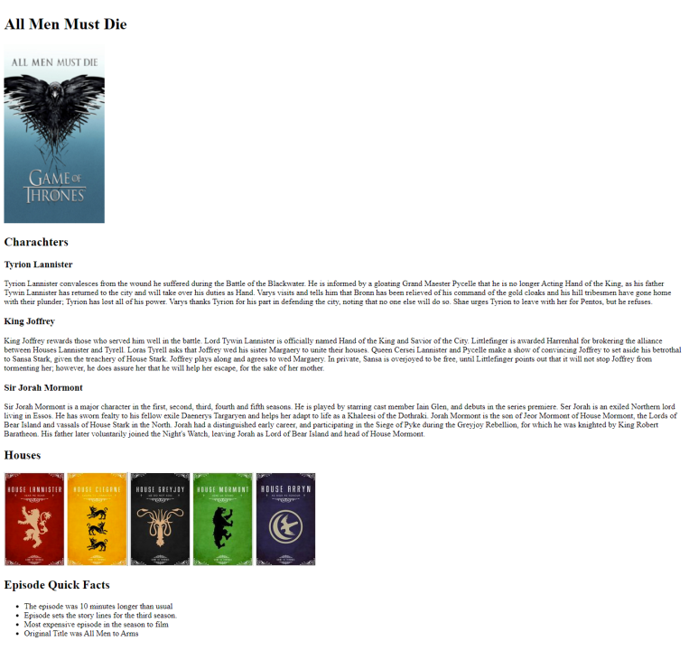

# Content Markup Exercise Instructions

## Markup Exercise

In this exercise you have been given copy and images that you have to markup. Look at the layout.jpg file provided in the exercise folder. You have to markup the content of the copy.txt file and include the image from the artwork for site folder to build the site. Remember that the purpose of markup is not for style. Do not worry about how the content looks but that you are using appropriate markup to create the site. Remember that all images must be semantically named therefore change the image file names to something more appropriate to the content. Also, the images provided should be placed into your project's img folder so you can fill out the src and alt attributes of each of the  elements you create. Make sure to validate your markup (https://validator.w3.org). The completed version should look like that shown below.

## Reference Result

